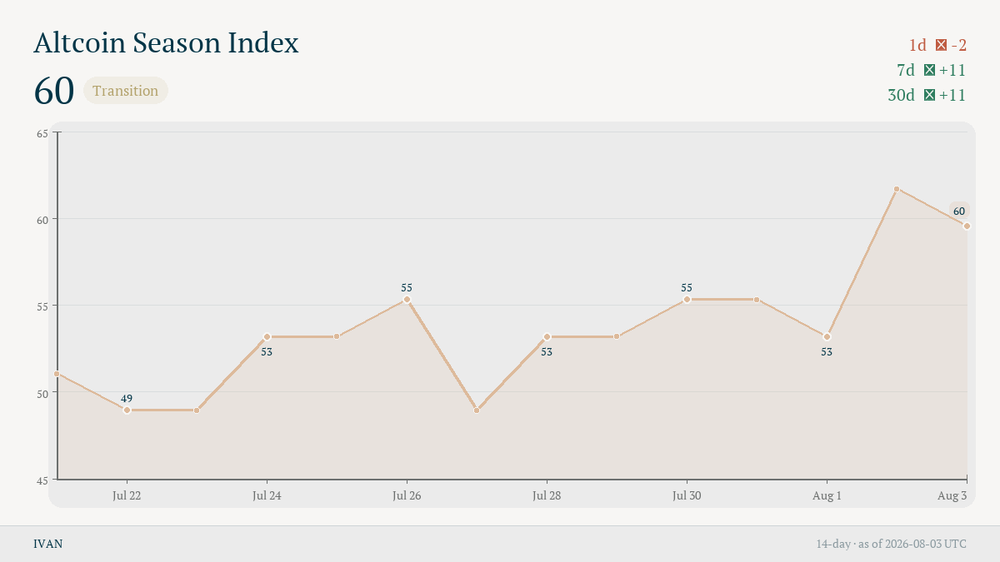
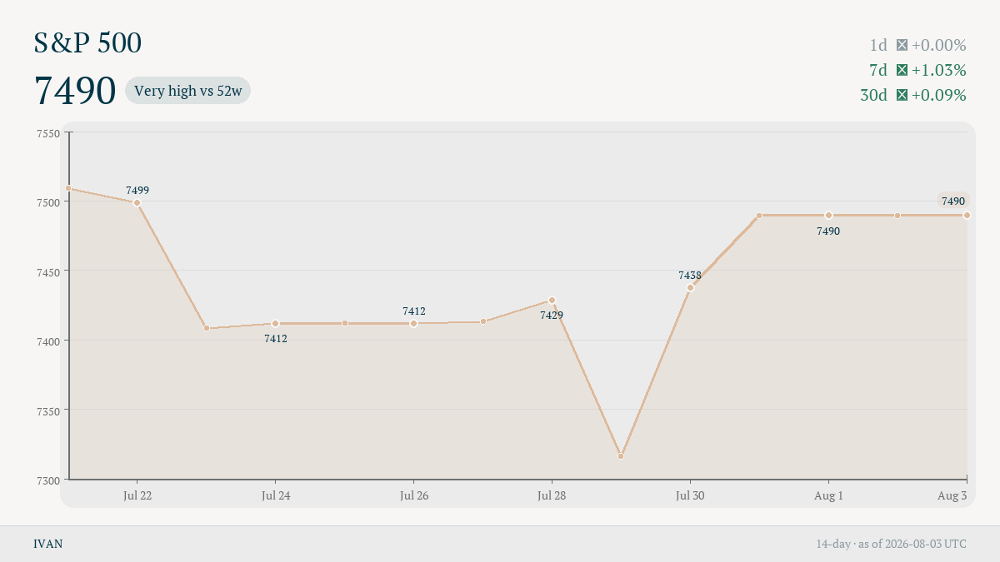
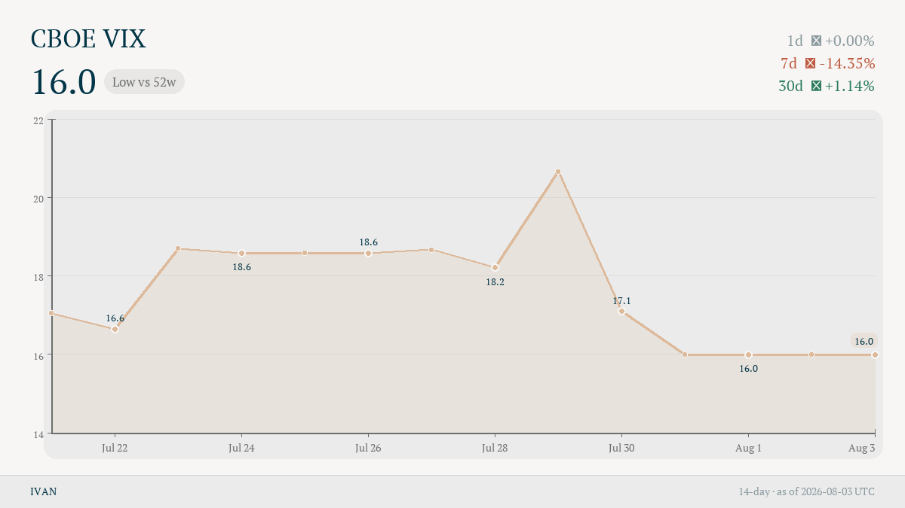

# IVAN Telegram feed · examples

Черновик постов (все индексы, включая `fng`).
На графике: оси X/Y с масштабом, маркеры на всех точках, подписи значений — последний день и каждые 2 дня ранее.

Полный прогон: `python -m telegram_feed --from-api --out telegram_feed/out`

Формат: см. [FORMAT.md](../FORMAT.md).

## altseason



Caption length: 178/250

```
🟠 Altcoin Season Index · 60 · Transition
📉 -2 (1d) · 📈 +11 (7d) · 📈 +11 (30d)
→ https://ivan.zatinatscky.com/i/altseason
——
IVAN · as of 2026-08-03 UTC · NFA
ivan.zatinatscky.com
```

---

## brent

Caption length: 181/250

```
🛢️ Brent Crude · $91.8 · High vs 52w
➡️ 0.00% (1d) · ➡️ 0.00% (7d) · 📈 +33.69% (30d)
→ https://ivan.zatinatscky.com/i/brent
——
IVAN · as of 2026-08-03 UTC · NFA
ivan.zatinatscky.com
```

---

## bvol

Caption length: 196/250

```
🟠 Bitcoin Volatility (DVOL) · 34.7 · Very low vs 52w
📉 -1.00% (1d) · 📉 -7.34% (7d) · 📉 -11.43% (30d)
→ https://ivan.zatinatscky.com/i/bvol
——
IVAN · as of 2026-08-03 UTC · NFA
ivan.zatinatscky.com
```

---

## cnnfng

Caption length: 167/250

```
📊 Stocks Fear & Greed · 46 · Fear
📈 +1 (1d) · 📈 +8 (7d) · 📈 +13 (30d)
→ https://ivan.zatinatscky.com/i/cnnfng
——
IVAN · as of 2026-08-03 UTC · NFA
ivan.zatinatscky.com
```

---

## dxy

Caption length: 186/250

```
💱 US Dollar Index (DXY) · 99.7 · High vs 52w
📉 -0.63% (1d) · 📉 -1.61% (7d) · 📉 -1.05% (30d)
→ https://ivan.zatinatscky.com/i/dxy
——
IVAN · as of 2026-08-03 UTC · NFA
ivan.zatinatscky.com
```

---

## funding

Caption length: 188/250

```
🟠 Perp Funding Rate · 0.006% · High vs 52w
📉 -0.001 (1d) · ➡️ 0.000 (7d) · 📉 -0.004 (30d)
→ https://ivan.zatinatscky.com/i/funding
——
IVAN · as of 2026-08-03 UTC · NFA
ivan.zatinatscky.com
```

---

## mvrv

Caption length: 179/250

```
🟠 MVRV Z-Score · 0.35 · Very low vs 52w
➡️ 0.00 (1d) · 📉 -0.08 (7d) · 📈 +0.02 (30d)
→ https://ivan.zatinatscky.com/i/mvrv
——
IVAN · as of 2026-08-03 UTC · NFA
ivan.zatinatscky.com
```

---

## nikkei

Caption length: 179/250

```
📊 Nikkei 225 · 63755 · High vs 52w
📉 -0.94% (1d) · 📉 -1.81% (7d) · 📉 -8.59% (30d)
→ https://ivan.zatinatscky.com/i/nikkei
——
IVAN · as of 2026-08-03 UTC · NFA
ivan.zatinatscky.com
```

---

## nupl

Caption length: 185/250

```
🟠 Net Unrealized P/L · 0.18 · Very low vs 52w
➡️ 0.00 (1d) · ➡️ 0.00 (7d) · 📈 +0.01 (30d)
→ https://ivan.zatinatscky.com/i/nupl
——
IVAN · as of 2026-08-03 UTC · NFA
ivan.zatinatscky.com
```

---

## spx



Caption length: 177/250

```
📊 S&P 500 · 7490 · Very high vs 52w
➡️ 0.00% (1d) · 📈 +1.03% (7d) · 📈 +0.09% (30d)
→ https://ivan.zatinatscky.com/i/spx
——
IVAN · as of 2026-08-03 UTC · NFA
ivan.zatinatscky.com
```

---

## ssr

Caption length: 192/250

```
🟠 Stablecoin Supply Ratio · 4.17 · Very low vs 52w
➡️ 0.00% (1d) · 📈 +0.51% (7d) · 📈 +2.71% (30d)
→ https://ivan.zatinatscky.com/i/ssr
——
IVAN · as of 2026-08-03 UTC · NFA
ivan.zatinatscky.com
```

---

## us10y

Caption length: 192/250

```
🏛️ US 10Y Treasury Yield · 4.75% · Very high vs 52w
➡️ 0.00 (1d) · 📈 +0.10 (7d) · 📈 +0.26 (30d)
→ https://ivan.zatinatscky.com/i/us10y
——
IVAN · as of 2026-08-03 UTC · NFA
ivan.zatinatscky.com
```

---

## vix



Caption length: 173/250

```
📊 CBOE VIX · 16.0 · Low vs 52w
➡️ 0.00% (1d) · 📉 -14.35% (7d) · 📈 +1.14% (30d)
→ https://ivan.zatinatscky.com/i/vix
——
IVAN · as of 2026-08-03 UTC · NFA
ivan.zatinatscky.com
```

---
